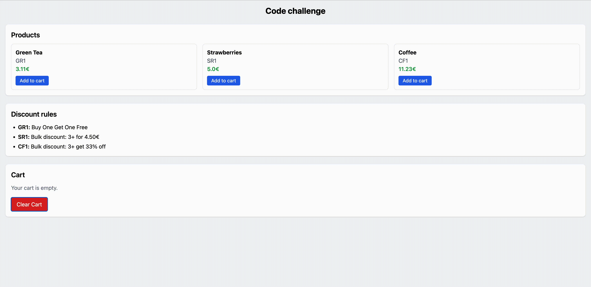

# Amenitiz

This is a code challenge I bravely fought for [amenitiz](https://github.com/amenitiz). They reached out, we had a first interview, and then they handed me this [Code challenge](https://github.com/amenitiz/be-technical-challenge) like it was the final boss battle.

Their epic feedback was:

```txt
Unfortunately, The outcome of the code challenge has been positive and your technical skills aren't aligned well with the requirement of this role.
```

Translation: “You’re good, but not our kind of good.”

So yeah… if you copy this project, you probably won’t pass either. But hey, misery loves company, so go ahead jaja… 😅

## Code challenge

This project is a fullstack application built to simulate a supermarket checkout system.



It includes:

- **Frontend**: React + Vite + TailwindCSS (responsible for displaying products, rules, and managing the checkout via API calls).
- **Backend**: Ruby on Rails (API-only, responsible for managing products, pricing rules, and checkout logic).
- **Infrastructure**: Docker & Docker Compose (for easy setup and reproducibility).

The challenge implements different **pricing** rules such as Buy-One-Get-One-Free, bulk discounts, and percentage discounts.

## Running with Docker

```cmd
docker compose up --build
```

This will start:

- **Frontend** → available at `http://localhost`.
- **Backend API** → available at `http://localhost:3000`.

## Features & Endpoints

The backend provides a simple API:

- `GET /products` → List products
- `GET /rules` → List pricing rules
- `POST /checkout/scan` → Add a product to the basket
- `GET /checkout` → Show current basket and total (with discounts applied)
- `DELETE /checkout` → Clear basket

The frontend consumes these APIs and provides a responsive UI built with TailwindCSS.

## Pricing Rules Explained

The system supports **pluggable pricing rules**. Each rule is stored in the database (`pricing_rules` table) and mapped to a service that applies its discount logic.

### BOGO Rule (`BogoRule`)

- **Description**: Buy-One-Get-One-Free.
- **Example**: For `GR1` (Green Tea), if you buy 2, you only pay 1.

### Bulk Price Rule (`BulkPriceRule`)

- **Description**: If you buy more than a threshold quantity, each product gets a fixed discounted price.
- **Example**: For `SR1` (Strawberries), if you buy 3 or more, the price drops to 4.50€ each.

### Percentage Bulk Rule (`PercentageBulkRule`)

- **Description**: If you buy more than a threshold quantity, a percentage factor is applied.
- **Example**: For `CF1` (Coffee), if you buy 3 or more, the price is multiplied by 2/3.

## Adding a New Pricing Rule

Creating a new rule is straightforward:

1.- **Create a new model** in `app/models/` (e.g. `free_shipping_rule.rb`).
2.- **Create a service** in `app/services/` that implements the discount logic (e.g. `FreeShippingRuleService`).

```rb
class FreeShippingRuleService
  def initialize(threshold)
    @threshold = threshold.to_s
  end

  # Apply discount to basket total
  # items: hash { 'SKU' => count }
  # catalog: ProductsCatalog (not used here)
  def discount(items, catalog)
    total_before = items.sum do |sku, count|
      catalog.find(sku).price * count.to_s
    end

    # If total >= threshold, reduce shipping cost (here, we assume shipping 5€)
    return 5 if total_before >= @threshold

    0
  end
end
```

3.- Make sure the model’s `#to_rule` method maps to the new service.

```rb
class FreeShippingRule < PricingRule
  def to_rule
    FreeShippingRuleService.new(self.sku, self.threshold)
  end
end
```

4.- **Seed it** into the database.

```rb
FreeShippingRule.create!(sku: "XYZ", threshold: 50, description: "Free shipping over 50€")
```

5.- It will automatically appear in `GET /rules` and be applied at checkout.

This design makes it very easy to **extend** the system with additional rules without touching the core Checkout logic.

## System Architecture

```sql
+-------------------+         +---------------------+         +-----------------+
|   React Frontend   |  --->  |  Rails API Backend  |  --->   |   SQLite DB     |
|  (Vite, Tailwind)  |        |   (Products, Rules, |         |  (Products,     |
|                    | <---   |   Checkout logic)   | <---    |   Cart, Rules)  |
+-------------------+         +---------------------+         +-----------------+
         |                             |                                |
         |     Axios API Calls         |   ActiveRecord ORM             |
         +--------------------------------------------------------------+
```

- **Client (React)** → Fetches products, rules, and manages checkout actions.
- **Server (Rails API)** → Handles business logic, applies pricing rules, returns totals.
- **Database (SQLite3)** → Stores products, cart items, and pricing rules.

## Testing

From inside the backend folder:

```cmd
bundle exec rspec
```

This runs the Rails RSpec test suite.
